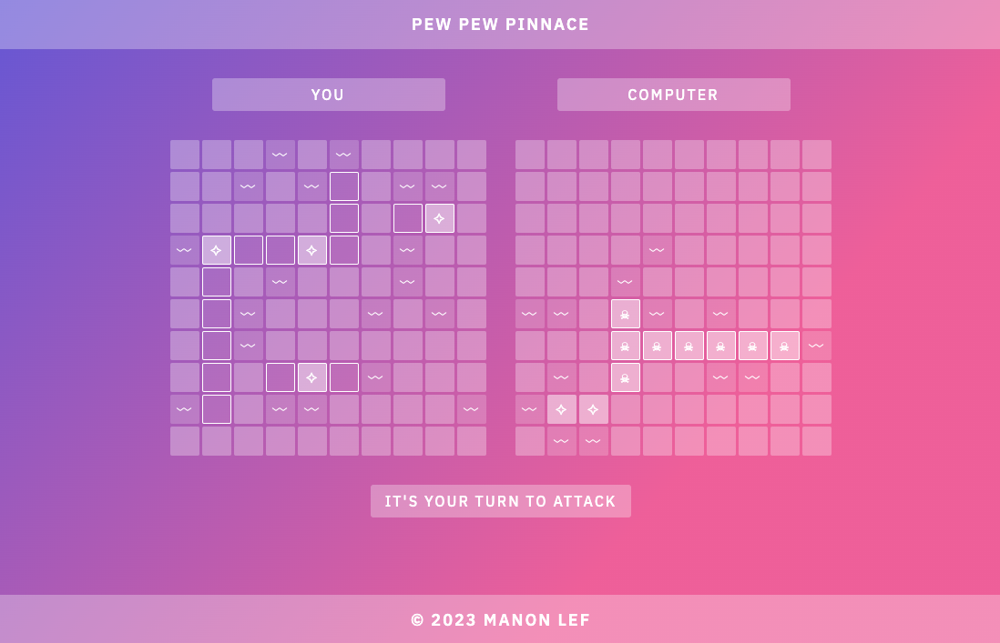

# Pew Pew Pinnace

## Result
[Try the Pew Pew Pinnace Game live here](https://manonlef.github.io/battleship/)

## About this project
Before this project we had a module about TDD with Jest. I had to implement what I learned about TDD in this project

This project is not made to be responsive for mobile screens. I might add that in the future. For now it's suggested to view it in a browser on a regular screen.

## Instructions / Behavior
- When dragging the ships, it will place the top or most left side of the ship on the cell where it's dropped.
- The game will automatically start once all ships are placed
- To restart after the game you need to manually refresh the page, I might add a restart option later
- The Ai is per instructions and is everything but smart

## Objectives
- [x] Write Unit Tests
- [x] Ships should have a `hit()` function that increases the number of ‘hits’ in your ship
- [x] `isSunk()` should be a function that calculates it based on their length and the number of ‘hits’.
- [x] Gameboards should have a receiveAttack function that takes a pair of coordinates, determines whether or not the attack hit a ship and then sends the ‘hit’ function to the correct ship, or records the coordinates of the missed shot.
- [x] Gameboards should keep track of missed attacks so they can display them properly.
- [x] Gameboards should be able to report whether or not all of their ships have been sunk.
- [x] The game is played against the computer, so make the ‘computer’ capable of making random plays. 
- [x] The AI does not have to be smart, but it should know whether or not a given move is legal. (i.e. it shouldn’t shoot the same coordinate twice).
- [x] The game should end once one player's ships have all been sunk.

## Optionals or Extra's I've added
- [x] drag and drop ships

## Notes and Lessons Learned

During this project I took some [notes that can be found here in their unedited form](./resources-and-notes/notes.md)

### Custom events

I decided to play with custom events for this project. It turned out okay but `dispatchEvent` and `new CustomEvent` broke my tests.
Because the tests run in Node.JS they can't use the event functionality I placed on the `window`. If I come back to this project later I will see if I can set up a Jest environment for it. For now I thought it out of scope and I circumvented that by disabling the event emitting to avoid breaking the tests

### Drag and Drop

Drag and drop was a bit tricky in the start. I now have it set up. It's not optimal yet since the ship shown placement doesn't equal the actual placement since that will be determined from the cell above which we drop and the ship will be placed horizontally or vertically from said cell. If you dragged the ship from the center, you might get the idea that it will place left and right of the dropzone for example but it will not. Instead it will drop only to the right (or below if the orientation is vertical)

### General

I did enjoy this project but I felt since the main objective was TDD, we soon travelled from that section into gameloop and view creation where the TDD was only there to make sure the working functions weren't altered to break. Once you have the tests running and all the methods work, you're mostly done with the testing part but there will still be a lot left to tie it all together into a playable game. 

## Features or things I'd love to work on for this project in the future
- [ ] change cursors based on board, hit before etc.
- [ ] reset board
- [ ] smarter Ai
- [ ] attack sounds
- [ ] ships sunk counter or display
- [ ] replay after win or loss
- [ ] add a controller to remove a bunch of things tied to the game loop
- [ ] mock event emitter or add a JSDOM env
- [ ] enhance styling